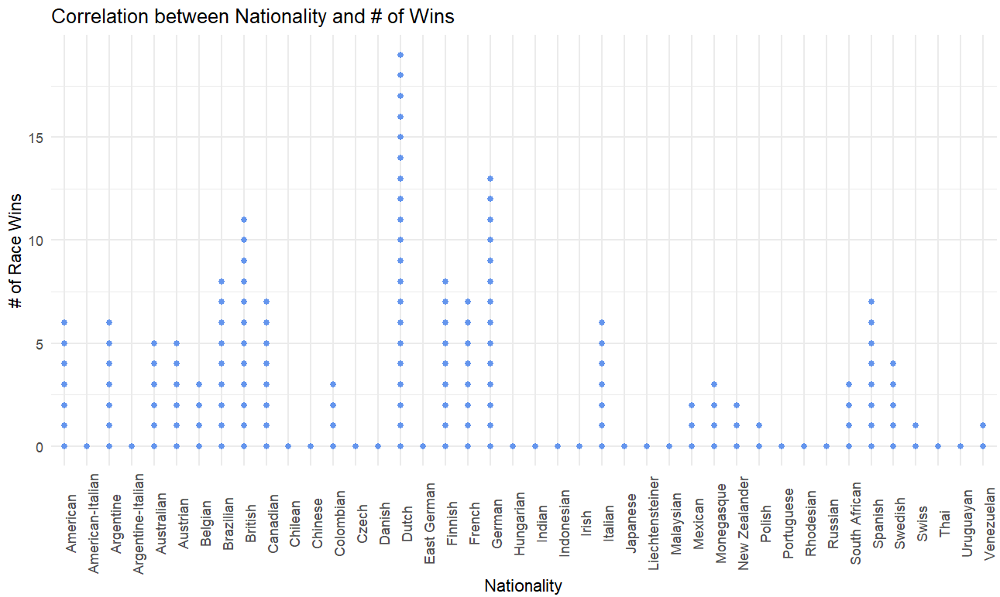

```{r setup, include=FALSE}
knitr::opts_chunk$set(echo = FALSE)
```


## Introduction

This project aims to analyze different aspects of a Formula 1 driver and how they contribute to the wins or loses of a team. 


## Background

Formula 1 is one of the highest levels in motorsport in the world. Wins and loses can come down to a matter of seconds or inches. It is a premier level of racing that has been around since 1950. Billions of dollars go into Formula 1 teams in order to be the most successful and win the most races. Over time this success has been defined by a teams ability to understand details about the car and driver that can lead to success. Massive amounts of data are necessary to ensure the optimal performance and success of a Formula 1 team. 

There is a well-known quote by the Mercedes Formula 1 team that states "Races are won at the track. Championships are won at the factory." (2019) The data used to build formula cars is kept secret by Formula 1 teams but understanding how different factors affect performance can better help fans enjoy the work that goes into the success of a team. One aspect that I wanted to focus on was the driver. This is the aspect of racing that fans have the most information about and so it is the easiest to analyze. 

## Data

The data for this project was found on Kaggle. The name of the data set is Formula 1 World Championship. It contains data on circuits, teams, drivers, lap times, pit stops, and race results. The datasets used for this research focus on the details of the drivers. 

The data was loaded into R and combined. I had multiple data sets that had different information on drivers. The data sets were loaded into R and then combined to be more useable. 

Different variables were explored by making graphs and analyzing the correlation. The # of wins was the primary variable explored.



The graph above shows how different nationalities have different rates of winning a Formula 1 race. This is likely due to differences in popularity across the world and not due to inherent differences in skill due to nationality. 

```{r load_libraries and clean data, echo=FALSE, message=FALSE, warning=FALSE}
# Load necessary libraries
library(tidyverse)
library(easystats)

drivers <- read.csv('./csv_files/drivers.csv')
driver_standings <- read.csv('./csv_files/driver_standings.csv')
View(driver_standings)
driver_df <- merge.data.frame(drivers, driver_standings)
ddf <- read.csv('./csv_files/F1Drivers_Dataset.csv')

```

```{r graph for time, echo=FALSE, message=FALSE}
ddf %>%
  ggplot(aes(x = Decade, y = Race_Wins)) +
  geom_col(fill = 'darkred') +
  theme_minimal() +
  labs(title = "Correlation between Time and Race Wins",
       x = "Time (in decades)",
       y = "Race Wins")
```

The graph above shows how the number of race wins has increased over time. This is likely due to the increased number of races on the Formula 1 calendar. The 2020 bar is significantly shorter but this is likely due to the decade still occurring. 

```{r race starts graph, echo=FALSE, message=FALSE}
ddf %>%
  ggplot(aes(x = Race_Starts, y = Race_Wins, color = Decade)) +
  geom_col() +
  theme_minimal() +
  labs(title = "Correlation between # of Race Starts and Race Wins",
       x = "# of Race Starts",
       y = "# of Race Wins")
```

The final graph shows the relationship between the # of race starts and the # of race wins. It is logical that more race starts would lead to more race wins. The graph is colored by time. Earlier decades tended to have less race starts as well as less race wins. 

## Modeling

After exploring and cleaning the data, different variables were modeled to see their affect on the number of race wins a driver would have. Five models were created in total. Below shows the code for the various models explored. 

```{r Procces_data, echo=TRUE, message=FALSE, warning=FALSE}
mod1 <- glm(data = ddf,
            formula = Race_Wins ~ Years_Active * Decade)

mod2 <- glm(data = ddf,
            formula =  Race_Wins ~ Decade * Race_Starts)

mod3 <- glm(data = ddf,
            formula =  Race_Wins ~ Nationality * Pole_Positions)

mod4 <- glm(data = ddf,
            formula =  Race_Wins ~ Nationality * Race_Starts)

mod5 <- glm(data = ddf,
            formula =  Race_Wins ~ Years_Active * Pole_Positions)
```

The models created above were further compared using the easystats package. This package made it simple to analyze different aspects of the model and choose the best output. Below is a graph from the compare_performance function. Model 3 was chosen from the five models above because of its slightly better fit than model 5. It lacks in the BIC statistic when compared to model 5 but it's fit is better in every other aspect.

```{r show comparison, echo=FALSE, message=FALSE, warning=FALSE}
compare_performance(mod5, mod4, mod3) %>% plot()

```

Finally this model output was modified to show only the significant variables at the 0.05 level. An output of 13 variables is given. 

```{r model cleaning, echo = FALSE, message= FALSE, warning=FALSE}
broom::tidy(mod3) %>%
  filter(p.value < 0.05)
```

## Discussion

This data set did not have as much information as was expected. Different variables did have a significant affect of the number of race wins that a driver had. It was interesting to see how different factors like the # of years active or pole positions contributed to a better model. Overall the skill of a driver is hard to define with the variables available to the average person. It is unlikely that a prediction of a driver's skill could be made off of age, nationality, or # of race starts alone. It would be more beneficial to have performance data of time on certain tracks or number of crashes to assess the compentancy of a driver. 

Unfortunately since much of the data surrounding Formula 1 teams is proprietary, it is difficult to make real and important models and comparisons with the data that is available. 
 


